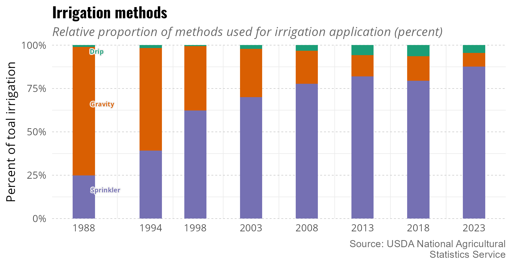

```{r setup, include=FALSE}
knitr::opts_chunk$set(echo = TRUE)
```

## README

Authors: Kade Terrell, Allen Berthold, Michael Schramm, Ed Rhodes; Texas Water Resources Institute, College Station, TX.

This repository includes the data and code used to generate figures
in the Texas irrigation report. Source data includes:

Dieter CA et al. 2018. Estimated Use of Water in the United States County-Level Data for 2015. https://www.sciencebase.gov/catalog/item/get/5af3311be4b0da30c1b245d8. https://doi.org/10.5066/F7TB15V5

Haynes JV et al. 2024. Monthly crop irrigation withdrawals and efficiencies by HUC12 watershed for years 2000-2020 within the conterminous United States (ver. 2.0, September 2024). [accessed 2026 Aug 5]. https://www.sciencebase.gov/catalog/item/6488734cd34ef77fcafe347a. https://doi.org/10.5066/P9LGISUM

Martin DJ et al. 2025. Estimating irrigation consumptive use for the conterminous United States: coupling satellite-sourced estimates of actual evapotranspiration with a national hydrologic model. Journal of Hydrology. 662:133909. https://doi.org/10.1016/j.jhydrol.2025.133909

TWDB. 2026a. Historical Irrigation Water Use Total Estimates and Acreage by Crop Type, 1985 and later. https://www3.twdb.texas.gov/apps/reports/WU_REP/Irrigation_Crop_Water_Use

TWDB. 2026b. Historical Water Use Estimates by County, 1974-1999. https://www3.twdb.texas.gov/apps/reports/WU_REP/Pre2000_County

TWDB. 2026c. Historical Water Use Estimates by County, 2000 and Later (Includes Reuse). https://www3.twdb.texas.gov/apps/reports/WU_REP/SumFinal_CountyReportWithReuse

USGS. 2026. National Water Availability Assessment Data Companion: Crop Irrigation Withdrawals Water-Use Model. https://water.usgs.gov/nwaa-data/


## Figures

 and the USGS  (Haynes et al. 2024; Martin et al. 2025; USGS 2026)")


")

 estimated by Texas Water Development Board (TWDB)(TWDB 2026a; TWDB 2026b)")

")

 USGS (Dieter et al. 2018)")

")

")

, followed by cotton (23%) and corn (15%) in 2023. Data from TWDB (2026c)")


